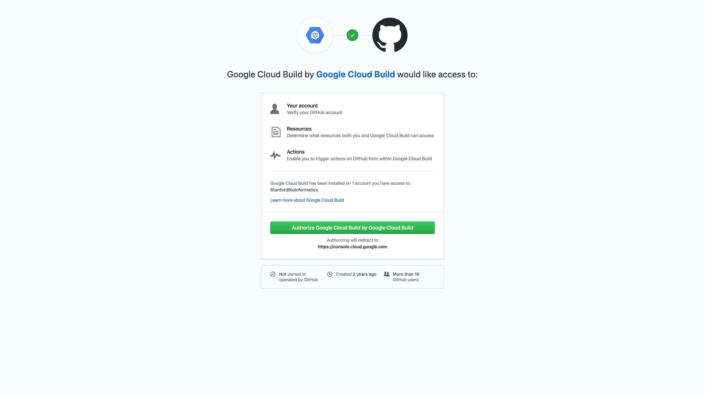
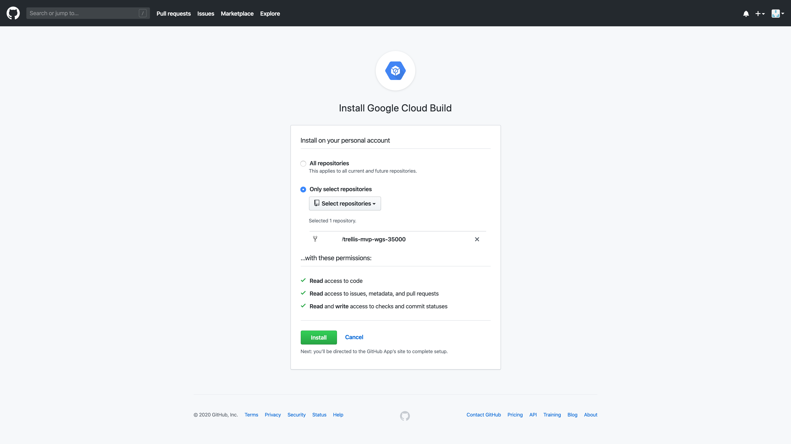
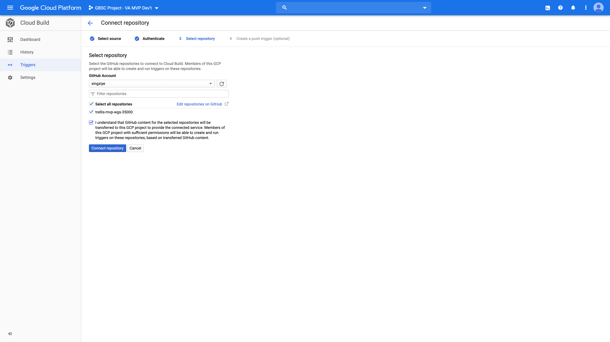

# Trellis Deployment Instructions

## A. Fork the Trellis repository
1. Fork a copy of this repo using the Fork button at the top-right corner of this GitHub page.

2. You should be automatically redirected to your forked copy of the repo. Clone the forked repo to your local machine using the "`git clone <forked repo URL>`" command on your command line.

## B. Connect the Trellis repo to Cloud Build
1. Navigate to the Cloud Build section of the Google Cloud Platform (GCP) console in the project you want to deploy Trellis.

```
https://console.cloud.google.com/cloud-build/triggers
```
2. Enable Cloud Build API if it has not been done yet.
3. Use the left-hand navigation panel to navigate to the "Triggers" section of the Cloud Build console.

4. At the top of the page, click the "Connect Repository" button and select the "GitHub (Cloud Build GitHub App)". Click "Continue".

5. From the GitHub Account drop-down menu, select the GitHub account which has the forked repo, or select "Add new account" to add it. Install Google Cloud Build if the GitHub App is not installed on any of your repositories. Be aware that as part of this process you are granting Google access to this repo.

6. A window should pop up that prompts you to select a GitHub account and then either "All repositories" or "Only select repositories". Choose the account with the forked repo, then "Only select repositories" and find the forked repository from the drop-down. Click the "Install" button.

7. You should be reverted back to the "Connect repository" page of the Cloud Build console. Under select all repositories you should see the Trellis forked repo listed. Click the checkbox next to it, read the terms-of-service blurb and then click the checkbox next to that, and finally click the "Connect repository" button.

8. After clicking, you should be transported to the "Create a push trigger" page. Click the "Skip for now" button near the bottom of the page content. Click "Continue" if prompted with a warning. Your forked Trellis repo has now been connected to Cloud Build!

## C. Add build triggers for Trellis
1. Navigate the command-line console or terminal on your local machine.
2. Run the "gcloud info" command to make sure the "Project" field matches the project you want to deploy Trellis into. If it doesn't, use the following command to change it.

```
gcloud config set project my-project
```

3. From the command-line, use the "cd" command to navigate to the root of the forked Trellis repo (e.g. "cd /Users/me/trellis")
4. Navigate to the gcp-build-triggers/templates directory.
5. For each yaml file, replace the bracketed keywords with your project values. Notice the name of trigger must be less than 64 characters.
6. Create any necessary storage buckets you specified in yaml file.
7. Run the following command to deploy each trigger:

```
gcloud beta builds triggers import --source=trigger.yaml
```
8. Navigate to the Cloud Build panel and check that each trigger has been deployed. If builds are not automatically triggered, trigger them automatically.

```
cd gcp-build-triggers
```
